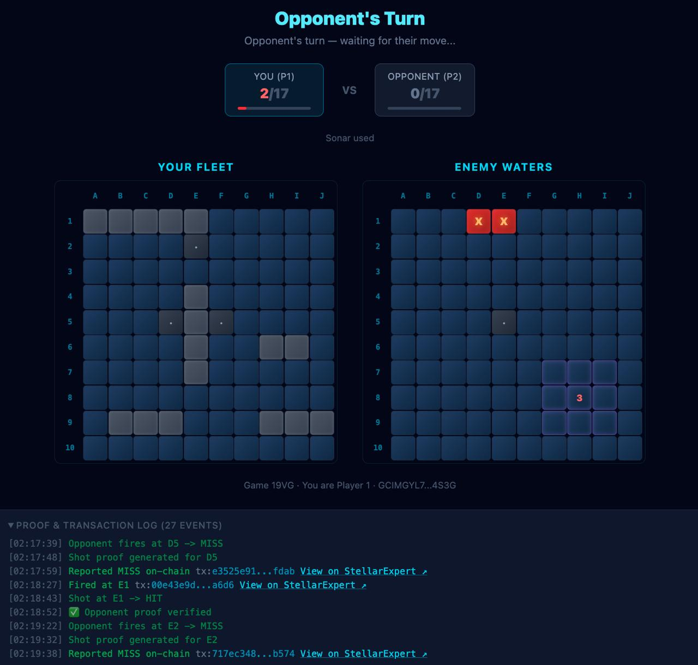

# Dark Fleet

**Zero-Knowledge Naval Warfare on Stellar**

A zero-knowledge battleship game built on Stellar for the **Stellar Hacks: ZK Gaming** hackathon. Two players connect via Freighter wallets, commit hidden board states using Pedersen hash commitments, and prove shot results with ZK proofs — all on-chain, all without revealing ship positions.

🎮 **[Play Now](https://darkfleet.ayazabbas.com)** · 📖 **[Docs](https://darkfleet.ayazabbas.com/docs)**



## How It Works

1. **Connect Wallet** — Both players connect Freighter wallets on Stellar testnet
2. **Create / Join** — Player 1 creates a game and shares the game code; Player 2 joins with the code
3. **Place Ships** — Each player places 5 ships on a private 10×10 grid
4. **Commit Board** — A ZK proof validates placement and commits a Pedersen hash on-chain
5. **Battle** — Players take turns firing shots; the defender generates a ZK proof for every hit/miss report, stored on-chain and verified by the opponent in real time
6. **Sonar Ping** — After 3 turns, unlock a one-time sonar ability — the opponent proves ship count in a 3×3 area via ZK without revealing positions
7. **Win** — First to sink all 17 ship cells claims victory on-chain

The game uses **Noir zero-knowledge circuits** for privacy and **Soroban smart contracts** on Stellar for trustless game state management.

## Architecture

```
  Browser A (Player 1)              Browser B (Player 2)
  ┌──────────────────┐              ┌──────────────────┐
  │  React Frontend  │              │  React Frontend  │
  │  + Noir WASM     │◄── verify ──▶│  + Noir WASM     │
  │  + Freighter     │              │  + Freighter     │
  └────────┬─────────┘              └────────┬─────────┘
           │                                 │
           │    Stellar Testnet (Soroban)     │
           │  ┌──────────────────────────┐   │
           └──┤   Battleship Contract    ├───┘
              │  Game state + ZK proofs  │
              └──────────┬───────────────┘
                         │
              ┌──────────┴───────────────┐
              │     Game Hub Contract    │
              │  (Hackathon registry)    │
              └──────────────────────────┘
```

### ZK Circuits (Noir)

Built with **Noir 0.34.0**, based on [BattleZips-Noir](https://github.com/BattleZips/BattleZips-Noir) patterns.

**Board Circuit** (`circuits/board/`)
- Validates ship placement: all 5 ships within 10×10 grid, no overlaps
- Ships: Carrier (5), Battleship (4), Cruiser (3), Submarine (3), Destroyer (2) = 17 cells
- Computes and outputs Pedersen hash commitment of ship positions
- Private input: `ships[15]` (x, y, orientation for each ship)
- Public output: board hash (Field)

**Shot Circuit** (`circuits/shot/`)
- Proves whether a shot at (x, y) is a hit or miss
- Verifies the prover's ships match their committed board hash
- Private input: `ships[15]`
- Public inputs: `board_hash`, `hit` (0 or 1), `shot_x`, `shot_y`

**Sonar Circuit** (`circuits/sonar/`)
- Proves the count of ship cells in a 3×3 area around a center point
- Verifies the prover's ships match their committed board hash
- Demonstrates ZK's power beyond simple boolean proofs — partial information disclosure
- Private input: `ships[15]`
- Public inputs: `board_hash`, `center_x`, `center_y`, `count`

### Smart Contract (Soroban/Rust)

The Soroban contract (`contracts/battleship/`) manages the full game lifecycle:

| Function | Description |
|----------|-------------|
| `new_game(player1)` | Create a game session, returns game ID |
| `join_game(game_id, player2)` | Join an existing game with a game code |
| `commit_board(game_id, player, board_hash)` | Submit Pedersen hash commitment |
| `take_shot(game_id, player, x, y)` | Fire a shot (must be your turn) |
| `report_result(game_id, player, hit, proof)` | Report hit/miss with ZK proof stored on-chain |
| `use_sonar(game_id, player, center_x, center_y)` | Sonar ping instead of firing (once per game, after 3 turns) |
| `report_sonar(game_id, player, count, proof)` | Report sonar count with ZK proof stored on-chain |
| `claim_victory(game_id, player)` | Claim win after 17 hits |
| `get_game(game_id)` | Read current game state (view-only) |

Integrates with the **Stellar Game Hub** contract (`CB4VZAT2U3UC6XFK3N23SKRF2NDCMP3QHJYMCHHFMZO7MRQO6DQ2EMYG`) via `start_game()` and `end_game()` calls.

### Frontend (React + TypeScript)

- Freighter wallet integration for 2-player on-chain gameplay
- Create/join game flow with shareable base-32 game codes
- Ship placement with click-to-place and R to rotate
- In-browser ZK proof generation via `@noir-lang/noir_js` + `@noir-lang/backend_barretenberg`
- On-chain battle: every shot, report, and sonar is a Stellar transaction
- Auto-reporting: opponent actions detected via polling, ZK proofs generated and reported automatically
- **Cross-verification**: opponent's browser fetches and verifies ZK proofs from on-chain state in real time
- Proof & transaction log with StellarExpert explorer links
- Dark theme with Tailwind CSS

### Trust Model & Anti-Cheat

Dark Fleet uses **on-chain proof storage + client-side cross-verification** to ensure fair play:

1. **Proof submission** — When a player reports a shot result (hit/miss) or sonar count, their browser generates a ZK proof and submits it alongside the report to the Soroban contract. The proof is stored as `Bytes` in the contract's game state.
2. **Cross-verification** — The opponent's browser fetches the proof from the contract state and verifies it client-side using the Barretenberg WASM verifier. If the proof is invalid, a cheating alert is displayed.
3. **Public auditability** — All proofs are stored on-chain and can be fetched and verified by anyone via `get_game(game_id)`.

```
P1 fires → P2 generates ZK proof → report_result(hit, proof) on-chain
                                        ↓
                            P1 fetches proof from contract
                            P1 verifies proof in-browser
                                        ↓
                               ✅ Valid / ❌ Invalid
```

**Future work:** On-chain proof verification (contract auto-rejects invalid proofs) via a Soroban UltraHonk verifier.

## Deployed on Stellar Testnet

- **Contract Address**: [`CAMPSSS224MFUVQY6X6LA2QIQEM7AFDKHXG4Q5IVWAJQHLQOX3WQL3EX`](https://stellar.expert/explorer/testnet/contract/CAMPSSS224MFUVQY6X6LA2QIQEM7AFDKHXG4Q5IVWAJQHLQOX3WQL3EX)
- **Live App**: [darkfleet.ayazabbas.com](https://darkfleet.ayazabbas.com)

## Quick Start

### Prerequisites

- [Noir 0.34.0](https://noir-lang.org/docs/getting_started/installation/) (`nargo`)
- [Rust](https://rustup.rs/) with `wasm32v1-none` target
- [Node.js](https://nodejs.org/) 18+
- [Stellar CLI](https://developers.stellar.org/docs/build/smart-contracts/getting-started/setup) (optional, for deployment)

### 1. Test ZK Circuits

```bash
cd circuits/board && nargo test
cd ../shot && nargo test
cd ../sonar && nargo test
```

### 2. Build Smart Contract

```bash
cd contracts/battleship
cargo build --target wasm32v1-none --release
cargo test
```

### 3. Run Frontend

```bash
cd frontend
npm install
npm run dev
```

Open http://localhost:5173 to play.

## Project Structure

```
dark-fleet/
├── circuits/
│   ├── board/           # Board validation ZK circuit
│   │   └── src/main.nr  # Ship placement + Pedersen hash
│   ├── shot/            # Shot verification ZK circuit
│   │   └── src/main.nr  # Hit/miss proof
│   └── sonar/           # Sonar ping ZK circuit
│       └── src/main.nr  # 3×3 area ship count proof
├── contracts/
│   └── battleship/      # Soroban smart contract
│       └── src/lib.rs   # Game state management
├── frontend/            # React web application
│   ├── src/
│   │   ├── App.tsx              # Main game flow (create/join/battle)
│   │   ├── components/
│   │   │   ├── Board.tsx        # 10×10 grid component
│   │   │   ├── ShipPlacement.tsx # Ship placement UI
│   │   │   ├── OnlineBattle.tsx # On-chain 2-player battle
│   │   │   └── GamePlay.tsx     # Hotseat battle (legacy)
│   │   ├── lib/
│   │   │   ├── game.ts          # Game logic & types
│   │   │   ├── gameCode.ts      # Base-32 game code encoding
│   │   │   ├── noir.ts          # ZK proof generation & verification
│   │   │   └── stellar.ts       # Stellar wallet & contract calls
│   │   └── pages/
│   │       └── Docs.tsx         # Documentation page
│   └── public/circuits/         # Compiled circuit artifacts
├── .github/workflows/
│   └── release.yml              # SEP-0055 attestation workflow
└── README.md
```

## Test Results

```
Board Circuit: 6 tests passed
  - Valid horizontal/vertical/mixed placements
  - Out-of-bounds detection
  - Ship collision detection

Shot Circuit: 7 tests passed
  - Hit detection (origin, middle of ship, vertical ships)
  - Miss detection
  - False hit/miss claim rejection
  - Wrong hash rejection

Sonar Circuit: 7 tests passed
  - Empty area scan (count 0)
  - Dense area scan (count 9)
  - Corner/edge clamping
  - Partial count with mixed layout
  - Wrong count rejection
  - Wrong hash rejection

Smart Contract: 10 tests passed
  - Game creation and joining
  - Board commitment
  - Shot and result reporting (with proof storage)
  - Full game to victory
  - Turn enforcement
  - Premature victory rejection
  - Sonar availability after 3 turns
  - Sonar full flow (use + report with proof)
  - Sonar too early rejection
  - Sonar double use rejection
```

## Technology Stack

| Component | Technology |
|-----------|-----------|
| ZK Circuits | Noir 0.34.0 (Pedersen hash, BN254) |
| Smart Contract | Soroban SDK 25.1.1 (Rust) |
| Frontend | React 19, TypeScript, Vite, Tailwind CSS |
| Proof Engine | noir_js + backend_barretenberg (in-browser WASM) |
| Blockchain | Stellar Soroban (Testnet) |
| Wallet | Freighter (@stellar/freighter-api) |

## Design Decisions

- **Pedersen hash** for board commitments — native to Noir circuits, efficient and ZK-friendly
- **Board hash as circuit output** — the board circuit computes and returns the hash, eliminating external hash computation
- **On-chain proof storage + client-side cross-verification** — ZK proofs stored on-chain with every report, verified by the opponent's browser in real time; on-chain UltraHonk verification is the natural next step
- **2-player on-chain multiplayer** — each player connects via Freighter in separate browser windows; game state synced via Soroban contract polling
- **Sonar ping (unique ZK mechanic)** — most ZK battleship implementations only prove binary hit/miss; our sonar circuit proves a *count* of ship cells in a region, demonstrating ZK's ability to disclose partial information without revealing exact positions
- **Base-32 game codes** — short, shareable codes (e.g. `19VG`) for game joining instead of raw numeric IDs

## Future Improvements

- On-chain proof verification via [UltraHonk Soroban Verifier](https://github.com/indextree/ultrahonk_soroban_contract)
- WebSocket real-time sync (replace polling)
- Ship sinking detection and animation
- Game replay from on-chain events
- Mainnet deployment

## Hackathon

Built for [Stellar Hacks: ZK Gaming](https://dorahacks.io/hackathon/stellar-hacks-zk-gaming/detail) — February 2026
